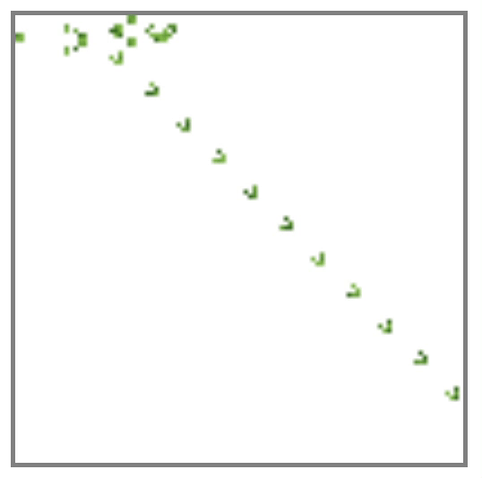

# CELULLAR ARTIFICIAL LIFE



## Description

Celullar artificial life using JavaScript.

## Index

- [Instalation](#instalation)
- [Usage](#usage)
- [Live Preview](#live-preview)
- [License](#license)

## Instalation

```
```

## Usage

```
```

## Live Preview

[Live Preview](https://66ea13afae29c1b1bc1ab1f3--sparkling-hotteok-5cc55c.netlify.app/)

## License

GNU GENERAL PUBLIC LICENSE. Version 3, 29 June 2007. Copyright (C) 2007 Free Software Foundation, Inc. <https://fsf.org/> Everyone is permitted to copy and distribute verbatim copies of this license document, but changing it is not allowed.